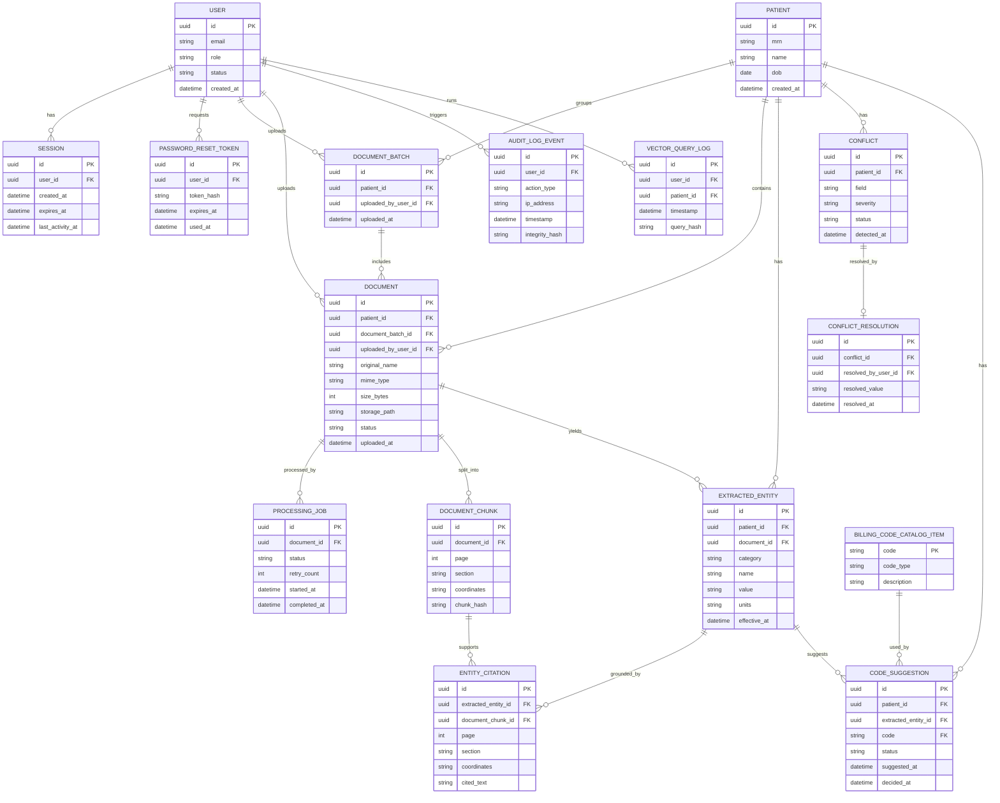

# Design Modelling

## UML Models Overview
These UML diagrams provide a shared, implementation-ready view of the Trust-First Clinical Intelligence Platform. The architectural views summarize key containers, integrations, and data paths derived from `.propel/context/docs/design.md`, while the sequence diagrams map each `UC-XXX` from `.propel/context/docs/spec.md` into time-ordered interactions. Together, they clarify system boundaries, responsibilities, and the "trust-first" invariants (grounding, auditability, human-in-the-loop decisions).

## Architectural Views

### Conceptual Architecture Diagram

### Component Architecture Diagram

### Deployment Architecture Diagram

### Data Flow Diagram

### Logical Data Model (ERD)

### Use Case Sequence Diagrams

#### UC-001: User Authentication
**Source**: [spec.md#UC-001](.propel/context/docs/spec.md#uc-001-user-authentication)

#### UC-001a: Admin User Creation
**Source**: [spec.md#UC-001a](.propel/context/docs/spec.md#uc-001a-admin-user-creation)

#### UC-002: Password Reset
**Source**: [spec.md#UC-002](.propel/context/docs/spec.md#uc-002-password-reset)

#### UC-003: Multi-Document Upload
**Source**: [spec.md#UC-003](.propel/context/docs/spec.md#uc-003-multi-document-upload)

#### UC-004: Document Processing (RAG Pipeline)
**Source**: [spec.md#UC-004](.propel/context/docs/spec.md#uc-004-document-processing-rag-pipeline)

#### UC-005: View Patient 360 Dashboard
**Source**: [spec.md#UC-005](.propel/context/docs/spec.md#uc-005-view-patient-360-dashboard)

#### UC-006: Resolve Data Conflicts
**Source**: [spec.md#UC-006](.propel/context/docs/spec.md#uc-006-resolve-data-conflicts)

#### UC-007: Review and Accept/Reject Billing Codes
**Source**: [spec.md#UC-007](.propel/context/docs/spec.md#uc-007-review-and-acceptreject-billing-codes)

#### UC-008: Query AI Clinical Assistant
**Source**: [spec.md#UC-008](.propel/context/docs/spec.md#uc-008-query-ai-clinical-assistant)

#### UC-009: Export Patient Data
**Source**: [spec.md#UC-009](.propel/context/docs/spec.md#uc-009-export-patient-data)

#### UC-010: Admin User Management
**Source**: [spec.md#UC-010](.propel/context/docs/spec.md#uc-010-admin-user-management)

#### UC-011: View Security Audit Logs
**Source**: [spec.md#UC-011](.propel/context/docs/spec.md#uc-011-view-security-audit-logs)

