# Requirements Specification: Trust-First Clinical Intelligence Platform

## Feature Goal
Build a standalone, integration-ready **Trust-First Clinical Intelligence Platform** that transforms healthcare staff's manual 20+ minute "data-detective" work into a 2-minute "review and verify" action. The platform ingests multiple clinical documents (PDF/DOCX), uses RAG-powered AI to extract and aggregate patient data into a unified **360-Degree Patient View**, with full explainability, conflict detection, and ICD-10/CPT code mapping.

**Current State:** Healthcare staff manually read dozens of pages of unstructured clinical reports to extract patient data, leading to time-consuming workflows, missed billing codes, data-entry errors, and undetected data conflicts.

**Desired End State:** An AI-powered platform providing:
- Automated extraction of clinical entities with 100% source grounding (no hallucinations)
- Multi-document aggregation with intelligent conflict detection
- Transparent AI with clickable source references for every extracted entity
- ICD-10/CPT code suggestions with Accept/Reject workflow
- Natural language querying via RAG-powered clinical assistant

## Business Justification

- **Clinical & Financial Value:** Directly reduces claim denials and patient safety risks by identifying data conflicts (e.g., conflicting medication dosages across documents)
- **Productivity Gains:** Target >60% reduction in "Time-on-Task" for processing patient files
- **Trust & Adoption:** 100% explainable AI with source citations addresses the "black box" trust deficit that plagues competitor solutions
- **Integration Ready:** FHIR-compatible data models enable future EHR integration without disrupting Phase 1 standalone deployment
- **Regulatory Compliance:** HIPAA-compliant architecture with immutable audit trails ensures governance requirements are met

**Problems Solved:**
| Stakeholder | Problem | Solution |
|-------------|---------|----------|
| Clinicians | Manual data gathering delays patient prep | Instant 360-degree patient view |
| Medical Coders | Missed billing codes cause claim denials | AI-suggested ICD-10/CPT with review workflow |
| Administrators | No visibility into data quality issues | Conflict detection with resolution tracking |
| Compliance Officers | Audit trail gaps | Immutable logging of all actions |

## Feature Scope

### In-Scope (Phase 1)
- Secure JWT-based authentication with session management
- Multi-document batch upload (up to 10 PDF/DOCX files, 50MB max each)
- Asynchronous RAG-based document processing via RabbitMQ
- Clinical entity extraction (10 core categories + extensible)
- Patient 360 Dashboard with source metadata and reference links
- Conflict detection and resolution UI
- ICD-10/CPT code mapping with Accept/Reject buttons
- AI Clinical Assistant (RAG-powered chatbot)
- Admin Dashboard (User Management, Security Logs, Analytics)
- Export functionality (CSV, JSON, clipboard)
- Health check endpoints for observability

### Out-of-Scope (Phase 1)
- Direct bi-directional EHR integration
- Fully autonomous (no-human-in-the-loop) processing
- Real-time CDI prompts at point of care
- Non-PDF/DOCX file formats (images, faxes, .txt)

### Success Criteria
- [ ] **SC-001:** Critical Conflicts Identified count demonstrates clinical/financial value
- [ ] **SC-002:** >60% reduction in Time-on-Task measured via UAT stopwatch tests
- [ ] **SC-003:** >98% AI-Human Agreement Rate (approved without edits)
- [ ] **SC-004:** 100% grounding accuracy (every entity has valid source citation)
- [ ] **SC-005:** Patient 360 Dashboard loads in under 3 seconds
- [ ] **SC-006:** 10-page PDF processed in under 60 seconds
- [ ] **SC-007:** 99.9% platform uptime
- [ ] **SC-008:** Total Patient Dashboards Created tracks adoption

---

## Functional Requirements

### Authentication & Session Management

- **FR-001:** System MUST provide secure user authentication using JWT tokens with 15-minute expiration
- **FR-001a:** System MUST provide a professional login interface with email and password input fields
- **FR-001b:** System MUST validate user credentials against the user database with secure password hashing
- **FR-001c:** System MUST display clear, actionable error messages for invalid login attempts
- **FR-001d:** System MUST show loading indicators during authentication process
- **FR-002:** System MUST enforce automatic logout after 15 minutes of user inactivity
- **FR-003:** System MUST provide secure logout functionality that terminates sessions and clears all authentication tokens server-side
- **FR-003a:** System MUST show logout confirmation and redirect to login page
- **FR-003b:** System MUST invalidate authentication tokens on logout
- **FR-004:** System MUST implement rate limiting for login attempts (5 per minute per IP) with account lockout after 5 failed attempts for 30 minutes
- **FR-005:** System MUST provide password reset process with email-based secure token links (1-hour expiration)
- **FR-006:** System MUST implement rate limiting for password reset requests (3 per hour per IP)
- **FR-007:** System MUST return HTTP 429 response when rate limits are exceeded
- **FR-008:** System MUST prevent concurrent sessions from the same user account
- **FR-009:** System MUST use HTTP-only cookies for JWT token storage to prevent XSS attacks
- **FR-009a:** System MUST implement secure session management

### Input Validation & Security

- **FR-009b:** System MUST validate email format using RFC 5322 compliant regex patterns
- **FR-009c:** System MUST enforce password complexity requirements: minimum 8 characters, mixed case letters, numbers, and special characters
- **FR-009d:** System MUST implement input sanitization to prevent SQL injection, XSS, and other injection attacks
- **FR-009e:** System MUST implement CSRF protection for all state-changing operations
- **FR-009f:** System MUST validate all user inputs on both frontend and backend
- **FR-009g:** System MUST reject requests with malformed or suspicious input patterns
- **FR-009h:** System MUST implement secure password hashing using bcrypt with minimum 12 rounds

### User Registration

- **FR-009i:** System MUST NOT provide public user registration functionality - only the static Admin user can create Standard User accounts
- **FR-009j:** System MUST provide Admin-only user creation form with required user information validation
- **FR-009k:** System MUST send email with login credentials to newly created users
- **FR-009l:** System MUST validate all user creation fields before account creation
- **FR-009m:** System MUST prevent creation of accounts with duplicate email addresses

### Password Reset Enhancement

- **FR-009n:** System MUST provide "Forgot Password" link prominently on login page
- **FR-009o:** System MUST send password reset emails with secure temporary tokens (1-hour expiration)
- **FR-009p:** System MUST provide password reset form accessible via email token
- **FR-009q:** System MUST display generic "check email" message for security (whether email exists or not)
- **FR-009r:** System MUST invalidate reset tokens after successful password change
- **FR-009s:** System MUST invalidate all existing sessions when password is reset
- **FR-009t:** System MUST log all password reset attempts and completions

### Role-Based Access Control (RBAC)

- **FR-010:** System MUST enforce two distinct user roles: Admin and Standard User
- **FR-010a:** System MUST provide one pre-configured static admin account created during initial database setup
- **FR-010b:** Static admin account credentials MUST be defined via secure environment variables
- **FR-010c:** System MUST prevent deletion or deactivation of the static admin account
- **FR-011:** System MUST restrict Admin role to User Management and System Health functions
- **FR-012:** System MUST restrict Standard User role to Patient Dashboard, Document Upload, and Profile functions
- **FR-013:** System MUST prevent Standard Users from accessing Admin Dashboard features

### Document Upload & Management

- **FR-014:** System MUST support multi-document batch upload of up to 10 files per batch
- **FR-015:** System MUST restrict file uploads to PDF and DOCX formats only with MIME type validation
- **FR-015a:** System MUST validate file extensions (.pdf, .docx) and reject files with incorrect extensions
- **FR-015b:** System MUST perform MIME type validation to ensure file content matches declared format
- **FR-015c:** System MUST reject password-protected PDF and DOCX files with clear error message
- **FR-015d:** System MUST detect and reject corrupted or malformed PDF and DOCX files
- **FR-015e:** System MUST validate document structure integrity before processing
- **FR-015f:** System MUST reject empty files (0 bytes) with appropriate error message
- **FR-015g:** System MUST reject files with suspicious or executable content embedded within documents
- **FR-016:** System MUST enforce maximum file size of 50MB per file
- **FR-017:** System MUST provide drag-and-drop upload interface with individual file validation
- **FR-018:** System MUST display individual progress tracking for each file during upload
- **FR-019:** System MUST acknowledge and validate file uploads in under 5 seconds
- **FR-020:** System MUST track document processing status: Pending, Processing, Completed, Failed, Validation_Failed
- **FR-021:** System MUST store uploaded documents in local file system with path stored in database (Phase 1)
- **FR-022:** System MUST display document list with status, upload date, and processing metadata

### Asynchronous Document Processing

- **FR-023:** System MUST queue uploaded documents in RabbitMQ for background processing
- **FR-024:** System MUST process documents asynchronously without blocking user interface
- **FR-025:** System MUST automatically retry failed processing jobs up to 3 attempts with exponential backoff
- **FR-026:** System MUST provide real-time status updates as processing completes
- **FR-027:** System MUST track processing metadata: job ID, retry count, processing time, start/completion timestamps
- **FR-028:** System MUST capture and display error messages for failed processing
- **FR-029:** System MUST monitor dead letter queue for failed jobs

### RAG-Based Entity Extraction

- **FR-030:** System MUST extract text with positional metadata from PDF files using PyPDFLoader
- **FR-031:** System MUST extract text with positional metadata from DOCX files using Docx2txtLoader
- **FR-032:** System MUST merge all extracted text from multiple documents belonging to the same patient before semantic chunking
- **FR-032a:** System MUST split documents into semantic chunks (500-1000 tokens) with 100-token overlap using RecursiveCharacterTextSplitter
- **FR-033:** System MUST generate 768-dimensional embeddings for each chunk using Google Gemini Embedding API (text-embedding-004)
- **FR-034:** System MUST store document chunks with embeddings in PostgreSQL with pgvector extension
- **FR-035:** System MUST preserve document structure metadata (document_id, page, section, coordinates) for each chunk
- **FR-036:** System MUST perform cosine similarity search to retrieve top-K (10-15) relevant chunks for entity extraction
- **FR-037:** System MUST extract all core entity categories in a single LLM call using Google Gemini 2.5 Flash
- **FR-038:** System MUST validate extracted entities against Pydantic schemas

### Clinical Entity Categories

- **FR-039:** System MUST extract Patient Demographics: Name, DOB, Address, Contact, MRN
- **FR-040:** System MUST extract Allergies: Allergen, Reaction, Severity
- **FR-041:** System MUST extract Medications: Name, Dosage, Frequency, Route
- **FR-042:** System MUST extract Diagnoses: Condition, Date
- **FR-043:** System MUST extract Procedures: Procedure name, Date
- **FR-044:** System MUST extract Lab Results: Test name, Value, Unit, Reference range
- **FR-045:** System MUST extract Vital Signs: BP, HR, Temp, SpO2, Weight, Height
- **FR-046:** System MUST extract Social History: Smoking, Alcohol, Occupation
- **FR-047:** System MUST extract Clinical Notes: Provider notes, Assessment, Plan
- **FR-048:** System MUST extract Document Metadata: Document type, Date, Provider, Facility
- **FR-049:** System MUST support extraction of additional relevant clinical data beyond core categories
- **FR-050:** System MUST link multiple documents to the same patient via MRN or name+DOB matching

### Document Grounding & Explainability

- **FR-051:** System MUST ensure 100% grounding - every extracted entity MUST cite source text from the document
- **FR-052:** System MUST provide exact document location (page, section, coordinates) for each extracted entity
- **FR-053:** System MUST display source metadata (document name, page number, section) for all entities
- **FR-054:** System MUST provide clickable reference links for critical entities (diagnoses, procedures, medications) that navigate to source document sections
- **FR-055:** System MUST provide extraction rationale for each entity on hover
- **FR-056:** System MUST prevent hallucination by rejecting entities without valid source citations

### Conflict Detection & Resolution

- **FR-057:** System MUST detect conflicts during entity extraction when different values exist for the same field across documents
- **FR-058:** System MUST identify conflicts for: DOB values, allergy information, medication dosages, and other critical data
- **FR-059:** System MUST output conflicts in structured format with conflicting value, source document, and document location
- **FR-060:** System MUST highlight conflicts in Patient 360 Dashboard with side-by-side comparison
- **FR-061:** System MUST require users to review and select correct value before finalizing patient record
- **FR-062:** System MUST log conflict resolution actions in audit trail

### ICD-10 & CPT Code Mapping

- **FR-063:** System MUST store ICD-10 codes in database with full-text search index on description
- **FR-064:** System MUST store CPT codes in database with full-text search index on description
- **FR-065:** System MUST map extracted diagnoses to ICD-10 codes using fuzzy text matching
- **FR-066:** System MUST map extracted procedures to CPT codes using fuzzy text matching
- **FR-067:** System MUST display suggested codes with source reference
- **FR-068:** System MUST provide Accept/Reject buttons for each suggested code
- **FR-069:** System MUST display "No ICD/CPT code found" with manual entry option for unmapped entities
- **FR-070:** System MUST track code status: pending, accepted, rejected, manually_added
- **FR-071:** System MUST support periodic refresh of ICD-10 and CPT code databases

### Patient 360 Dashboard

- **FR-072:** System MUST display aggregated patient profile: Demographics, Document Info, Allergies, Vitals, Social History
- **FR-073:** System MUST display clinical content: Reason for Visit, Active Problems, Medications, Procedures, Lab Results, Plan of Treatment
- **FR-074:** System MUST display coding outputs: Suggested ICD-10 and CPT codes with Accept/Reject buttons
- **FR-075:** System MUST load Patient 360 Dashboard in under 3 seconds
- **FR-076:** System MUST allow users to edit/correct extracted data with source metadata preserved
- **FR-077:** System MUST display conflict resolution UI for identified data conflicts

### AI Clinical Assistant (Chatbot)

- **FR-078:** System MUST provide AI-powered chat interface for natural language queries about patient documents
- **FR-079:** System MUST perform vector similarity search across all patient documents for each query
- **FR-080:** System MUST return results ranked by relevance with source links
- **FR-081:** System MUST support queries like "Summarize medication history" and "Show lab results from last visit"

### Export & Finalization

- **FR-082:** System MUST provide "Finalize & Export" function after conflict resolution and code review
- **FR-083:** System MUST export finalized data to CSV format
- **FR-084:** System MUST export finalized data to JSON format
- **FR-085:** System MUST support copying finalized data to clipboard
- **FR-086:** System MUST prevent export until all conflicts are resolved

### Admin Dashboard

- **FR-087:** System MUST provide Admin tools to create new user accounts
- **FR-088:** System MUST provide Admin tools to update existing user accounts
- **FR-089:** System MUST provide Admin tools to deactivate user accounts
- **FR-090:** System MUST provide searchable, granular security audit trail
- **FR-091:** System MUST display business analytics: system usage, AI accuracy trends, processing volumes
- **FR-092:** System MUST display analytics with charts and graphs

### Productivity & Quality Dashboard

- **FR-093:** System MUST display "Critical Conflicts Identified" count
- **FR-094:** System MUST display "AI-Human Agreement Rate" metric
- **FR-095:** System MUST display "Total Patient Dashboards Created" metric
- **FR-096:** System MUST display "Time-on-Task" metrics for user productivity tracking

### Audit Trail

- **FR-097:** System MUST log all authentication events with detailed metadata:
  - **LOGIN_SUCCESS:** User ID, IP address, timestamp, user agent, session ID
  - **LOGIN_FAILED:** Attempted email, IP address, timestamp, failure reason, attempt count
  - **LOGOUT:** User ID, IP address, timestamp, session duration
  - **SESSION_EXPIRED:** User ID, IP address, timestamp, expiration reason
  - **PASSWORD_RESET_REQUESTED:** Email address, IP address, timestamp, token ID
  - **PASSWORD_RESET_COMPLETED:** User ID, IP address, timestamp, token ID
  - **ACCOUNT_LOCKED:** User ID, IP address, timestamp, lock duration
  - **ACCOUNT_UNLOCKED:** User ID, admin ID, IP address, timestamp
  - **RATE_LIMIT_EXCEEDED:** IP address, timestamp, endpoint, attempt count
- **FR-098:** System MUST log all user management events: USER_CREATED, USER_UPDATED, USER_ROLE_CHANGED, USER_DEACTIVATED, USER_REACTIVATED
- **FR-099:** System MUST log all document events: DOCUMENT_UPLOADED, DOCUMENT_PROCESSING_STARTED, DOCUMENT_PROCESSING_COMPLETED, DOCUMENT_PROCESSING_FAILED
- **FR-100:** System MUST log all patient data events: PATIENT_360_VIEWED, PATIENT_DATA_EXPORTED, DIAGNOSIS_ADDED, DIAGNOSIS_REMOVED, MEDICATION_UPDATED, CONFLICT_RESOLVED, ICD_CODE_ACCEPTED, ICD_CODE_REJECTED, CPT_CODE_ACCEPTED, CPT_CODE_REJECTED
- **FR-101:** System MUST include User ID, Action type, Timestamp, IP Address, and action-specific metadata in all audit logs
- **FR-102:** System MUST explicitly log VIEW_PATIENT access (who viewed PHI)
- **FR-103:** System MUST ensure audit trail is immutable
- **FR-103a:** System MUST store audit logs with cryptographic integrity verification
- **FR-103b:** System MUST retain authentication audit logs for minimum 7 years for HIPAA compliance

### Health Checks & Observability

- **FR-104:** System MUST expose /health endpoint on Backend API for system status
- **FR-105:** System MUST expose /health, /health/ready, /health/live endpoints on AI Worker
- **FR-106:** System MUST provide RabbitMQ monitoring UI for queue metrics, message rates, consumer status
- **FR-107:** System MUST expose core metrics (queue depth, latency) to external monitoring tools
- **FR-108:** System MUST implement structured logging for centralized log aggregation

### Vector Data Security

- **FR-109:** System MUST encrypt embeddings at rest
- **FR-110:** System MUST ensure no PHI is stored in embedding metadata
- **FR-111:** System MUST enforce row-level security on document_chunks table respecting user permissions
- **FR-112:** System MUST log vector queries in audit trail
- **FR-113:** System MUST delete vector embeddings when source document is deleted

### User Interface Pages

- **FR-114:** System MUST provide public Login page with professional healthcare-appropriate design
- **FR-114a:** Login page MUST include email and password input fields with proper validation
- **FR-114b:** Login page MUST display clear error messages for validation failures
- **FR-114c:** Login page MUST show loading spinner during authentication process
- **FR-114d:** Login page MUST include "Forgot Password" link prominently displayed
- **FR-115:** System MUST provide public Forgot Password page
- **FR-115a:** Forgot Password page MUST include email input with validation
- **FR-115b:** Forgot Password page MUST display confirmation message after submission
- **FR-115c:** Forgot Password page MUST include link back to login page
- **FR-116:** System MUST provide public Reset Password page
- **FR-116a:** Reset Password page MUST validate reset token before displaying form
- **FR-116b:** Reset Password page MUST include new password and confirm password fields
- **FR-116c:** Reset Password page MUST display password strength indicator
- **FR-116d:** Reset Password page MUST show success message after password reset
- **FR-117:** System MUST provide Standard User Dashboard page
- **FR-118:** System MUST provide Standard User Document Upload page
- **FR-119:** System MUST provide Standard User Document List page
- **FR-120:** System MUST provide Standard User Patient 360 View page
- **FR-121:** System MUST provide Standard User Profile page
- **FR-122:** System MUST provide Admin User Management page

---

## Use Case Analysis

### Actors & System Boundary

- **Standard User (Primary Actor):** Healthcare staff including clinicians, medical coders, and administrators who upload documents, review extracted data, resolve conflicts, and finalize patient records
- **Admin User (Primary Actor):** System administrators responsible for user management, security monitoring, and system health oversight
- **AI Worker (System Actor):** Background processing service that performs RAG-based document processing and entity extraction
- **RabbitMQ (System Actor):** Message broker that queues and distributes document processing jobs
- **Google Gemini API (External System):** Provides embedding generation and LLM capabilities for entity extraction
- **PostgreSQL with pgvector (System Actor):** Database storing patient data, document chunks, embeddings, and audit logs
- **SMTP Service (External System):** Sends password reset emails

### Use Case Specifications

#### UC-001: User Authentication
- **Actor(s):** Standard User, Admin User
- **Goal:** Securely access the platform with valid credentials
- **Preconditions:** User has valid account credentials
- **Success Scenario:**
  1. User navigates to Login page
  2. User enters email and password
  3. System validates credentials against database
  4. System generates JWT access token (15-min)
  5. System creates session and redirects to Dashboard
  6. System logs LOGIN_SUCCESS event
- **Extensions/Alternatives:**
  - 3a. Invalid credentials: System increments failed attempt counter, displays error, logs LOGIN_FAILED
  - 3b. Account locked: System displays lockout message with remaining time
  - 3c. Rate limit exceeded: System returns HTTP 429
- **Postconditions:** User is authenticated with active session

##### Use Case Diagram
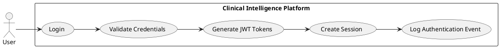

#### UC-001a: Admin User Creation
- **Actor(s):** Admin User
- **Goal:** Create new user account for healthcare staff
- **Preconditions:** Admin is authenticated with Admin role
- **Success Scenario:**
  1. Admin navigates to User Management page
  2. Admin clicks "Create New User" button
  3. Admin enters required information (name, email, role)
  4. System validates input format and checks for duplicate email
  5. System generates secure temporary password
  6. System creates user account with active status
  7. System sends email with login credentials to new user
  8. System logs USER_CREATED event
- **Extensions/Alternatives:**
  - 4a. Invalid input: Display validation errors, require correction
  - 4b. Duplicate email: Display error message
  - 7a. Email delivery fails: Display retry option, log error
- **Postconditions:** User account created and credentials sent

##### Use Case Diagram
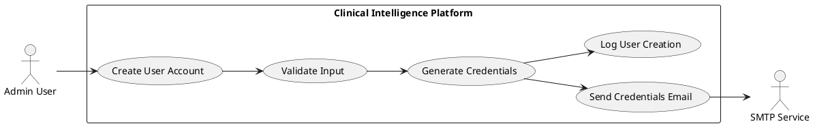

#### UC-002: Password Reset
- **Actor(s):** Standard User, Admin User
- **Goal:** Reset forgotten password securely
- **Preconditions:** User has registered email in system
- **Success Scenario:**
  1. User navigates to Forgot Password page
  2. User enters registered email address
  3. System validates email exists and rate limit not exceeded
  4. System generates secure reset token (1-hour expiration)
  5. System sends reset link via SMTP email
  6. User clicks link and navigates to Reset Password page
  7. User enters new password meeting complexity requirements
  8. System updates password hash and invalidates token
  9. System logs PASSWORD_RESET_COMPLETED event
- **Extensions/Alternatives:**
  - 3a. Email not found: System displays generic "check email" message (security)
  - 3b. Rate limit exceeded: System returns HTTP 429
  - 6a. Token expired: System displays error, requires new reset request
- **Postconditions:** User password is updated, old sessions invalidated

##### Use Case Diagram
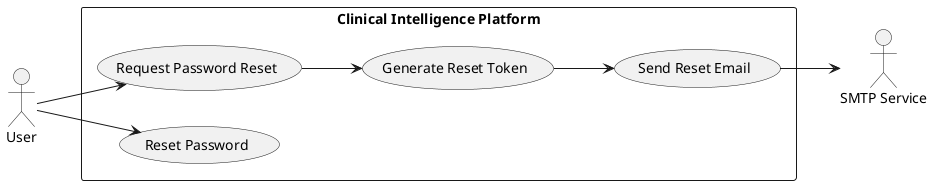

#### UC-003: Multi-Document Upload
- **Actor(s):** Standard User
- **Goal:** Upload multiple clinical documents for a patient
- **Preconditions:** User is authenticated, has Standard User role
- **Success Scenario:**
  1. User navigates to Document Upload page
  2. User drags and drops up to 10 files (PDF/DOCX)
  3. System validates each file: extension (.pdf, .docx), MIME type, size (≤50MB), structure integrity, password protection, corruption
  4. System displays upload progress for each file
  5. System acknowledges uploads within 5 seconds
  6. System stores files in local file system with path in database
  7. System queues each document in RabbitMQ for processing
  8. System logs DOCUMENT_UPLOADED event for each file
  9. System displays Document List with Pending status
- **Extensions/Alternatives:**
  - 3a. Invalid file extension: System rejects file, displays "Only PDF and DOCX files are allowed" error
  - 3b. MIME type mismatch: System rejects file, displays "File content does not match declared format" error
  - 3c. File too large: System rejects file, displays "File exceeds 50MB limit" error
  - 3d. Password-protected file: System rejects file, displays "Password-protected files are not supported" error
  - 3e. Corrupted file: System rejects file, displays "File appears to be corrupted or malformed" error
  - 3f. Empty file: System rejects file, displays "Empty files cannot be processed" error
  - 3g. Suspicious content: System rejects file, displays "File contains suspicious or executable content" error
  - 3h. Batch limit exceeded: System accepts first 10 files, warns about remainder
- **Postconditions:** Valid documents stored and queued for processing, invalid files rejected with clear error messages

##### Use Case Diagram
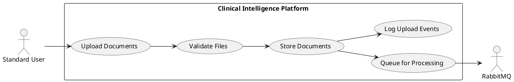

#### UC-004: Document Processing (RAG Pipeline)
- **Actor(s):** AI Worker, RabbitMQ, Google Gemini API, PostgreSQL
- **Goal:** Extract clinical entities from uploaded documents with full grounding
- **Preconditions:** Document queued in RabbitMQ, AI Worker running
- **Success Scenario:**
  1. AI Worker consumes document job from RabbitMQ
  2. System logs DOCUMENT_PROCESSING_STARTED
  3. AI Worker loads document using LangChain loader (PyPDFLoader/Docx2txtLoader)
  4. AI Worker extracts text with positional metadata (page, section, coordinates)
  5. AI Worker splits text into chunks (500-1000 tokens, 100-token overlap)
  6. AI Worker generates embeddings via Google Gemini Embedding API
  7. AI Worker stores chunks + embeddings in pgvector with metadata
  8. AI Worker performs cosine similarity search for top-K chunks
  9. AI Worker sends single extraction prompt with chunks to Gemini LLM
  10. Gemini extracts all entity categories with source citations and conflict identification
  11. AI Worker validates entities against Pydantic schemas
  12. AI Worker maps diagnoses to ICD-10 and procedures to CPT via database lookup
  13. AI Worker stores structured entities and updates document status to Completed
  14. System logs DOCUMENT_PROCESSING_COMPLETED
- **Extensions/Alternatives:**
  - 3a. Unsupported format: Mark as Validation_Failed, log error
  - 6a. Embedding API error: Retry with exponential backoff (max 3 attempts)
  - 9a. LLM API error: Retry with exponential backoff
  - 11a. Validation fails: Mark as Failed, log validation errors
  - *a. Max retries exceeded: Move to dead letter queue, mark as Failed
- **Postconditions:** Entities extracted, stored, and available for Patient 360 view

##### Use Case Diagram
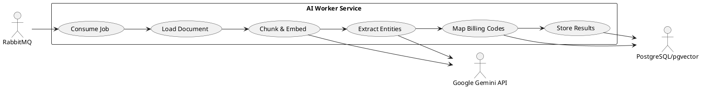

#### UC-005: View Patient 360 Dashboard
- **Actor(s):** Standard User
- **Goal:** Review aggregated patient data from multiple documents
- **Preconditions:** User authenticated, documents processed successfully
- **Success Scenario:**
  1. User navigates to Patient 360 View for a patient
  2. System loads aggregated patient data within 3 seconds
  3. System displays Patient Profile: Demographics, Allergies, Vitals, Social History
  4. System displays Clinical Content: Problems, Medications, Procedures, Lab Results, Plan
  5. System displays source metadata (document name, page, section) for each entity
  6. System displays clickable reference links for critical entities
  7. System highlights any detected conflicts with side-by-side comparison
  8. System displays suggested ICD-10/CPT codes with Accept/Reject buttons
  9. System logs PATIENT_360_VIEWED event
- **Extensions/Alternatives:**
  - 2a. Loading exceeds 3 seconds: Display loading indicator, log performance issue
  - 7a. User clicks reference link: Navigate to source document section
- **Postconditions:** User has viewed complete patient data with full traceability

##### Use Case Diagram
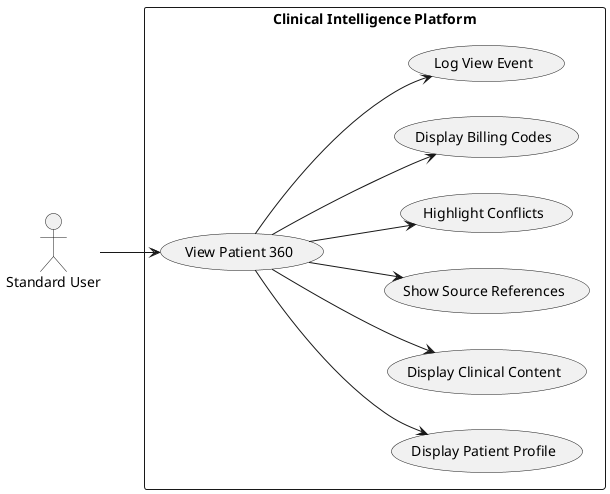

#### UC-006: Resolve Data Conflicts
- **Actor(s):** Standard User
- **Goal:** Review and resolve conflicting data from multiple documents
- **Preconditions:** Conflicts detected during document processing
- **Success Scenario:**
  1. User views Patient 360 Dashboard with highlighted conflicts
  2. System displays side-by-side comparison of conflicting values
  3. System shows source document and location for each conflicting value
  4. User reviews source references to determine correct value
  5. User selects the correct value for each conflict
  6. System updates patient record with resolved value
  7. System logs CONFLICT_RESOLVED event with selection details
- **Extensions/Alternatives:**
  - 4a. User needs more context: Click reference link to view full source section
  - 5a. Neither value correct: User manually edits to enter correct value
- **Postconditions:** All conflicts resolved, patient record consistent

##### Use Case Diagram
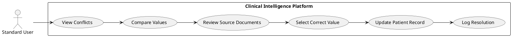

#### UC-007: Review and Accept/Reject Billing Codes
- **Actor(s):** Standard User (Medical Coder)
- **Goal:** Validate AI-suggested ICD-10 and CPT codes
- **Preconditions:** Document processed with code suggestions
- **Success Scenario:**
  1. User views Patient 360 Dashboard coding section
  2. System displays suggested ICD-10 codes with source references
  3. System displays suggested CPT codes with source references
  4. User clicks reference link to verify code against source text
  5. User clicks Accept for valid codes
  6. User clicks Reject for invalid codes
  7. System logs ICD_CODE_ACCEPTED/REJECTED and CPT_CODE_ACCEPTED/REJECTED events
- **Extensions/Alternatives:**
  - 2a. No code found for entity: Display "No ICD/CPT code found" with manual entry option
  - 6a. User manually adds code: System logs code with manually_added status
- **Postconditions:** All billing codes reviewed, accepted codes ready for export

##### Use Case Diagram
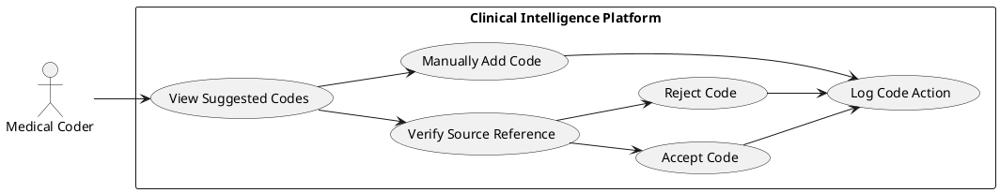

#### UC-008: Query AI Clinical Assistant
- **Actor(s):** Standard User
- **Goal:** Ask natural language questions about patient documents
- **Preconditions:** Documents processed with vector embeddings stored
- **Success Scenario:**
  1. User opens AI Clinical Assistant chat interface
  2. User enters natural language query (e.g., "Summarize medication history")
  3. System generates query embedding via Gemini API
  4. System performs vector similarity search across patient's document chunks
  5. System retrieves top-K relevant chunks ranked by similarity
  6. System generates response using Gemini LLM with retrieved context
  7. System displays response with source links to relevant document sections
- **Extensions/Alternatives:**
  - 5a. No relevant chunks found: Display "No relevant information found" message
- **Postconditions:** User receives AI-generated answer with source citations

##### Use Case Diagram
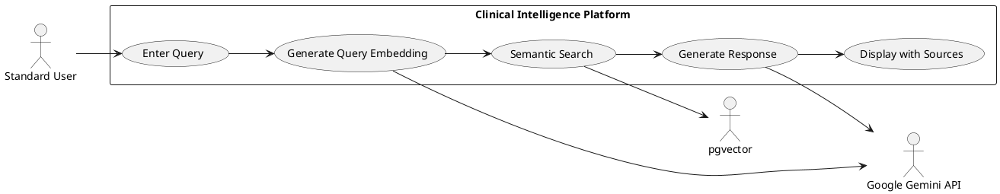

#### UC-009: Export Patient Data
- **Actor(s):** Standard User
- **Goal:** Export finalized patient data for external use
- **Preconditions:** All conflicts resolved, codes reviewed
- **Success Scenario:**
  1. User completes conflict resolution and code review
  2. User clicks "Finalize & Export" button
  3. System validates all conflicts are resolved
  4. System presents export format options: CSV, JSON, Clipboard
  5. User selects desired format
  6. System generates export file with all approved data
  7. System logs PATIENT_DATA_EXPORTED event
- **Extensions/Alternatives:**
  - 3a. Unresolved conflicts exist: Display error, highlight pending conflicts
  - 5a. CSV selected: Generate comma-separated file with headers
  - 5b. JSON selected: Generate structured JSON document
  - 5c. Clipboard selected: Copy formatted text to clipboard
- **Postconditions:** Patient data exported in selected format

##### Use Case Diagram
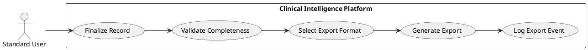

#### UC-010: Admin User Management
- **Actor(s):** Admin User
- **Goal:** Manage platform user accounts
- **Preconditions:** User authenticated with Admin role
- **Success Scenario:**
  1. Admin navigates to User Management page
  2. System displays list of all users with status
  3. Admin performs one of: Create, Update, Deactivate user
  4. For Create: Admin enters user details, system validates, creates account
  5. For Update: Admin modifies user details, system saves changes
  6. For Deactivate: Admin confirms, system deactivates account
  7. System logs corresponding USER_* event
- **Extensions/Alternatives:**
  - 4a. Duplicate email: Display validation error
  - 6a. Self-deactivation attempt: Prevent action, display error
- **Postconditions:** User account created/updated/deactivated as requested

##### Use Case Diagram
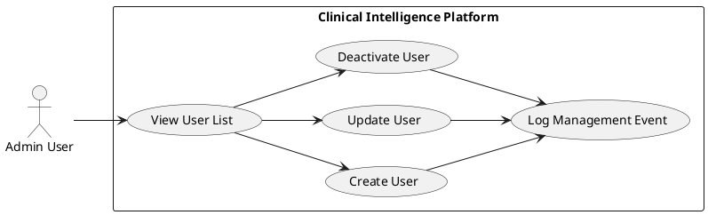

#### UC-011: View Security Audit Logs
- **Actor(s):** Admin User
- **Goal:** Review system security events and user activity
- **Preconditions:** User authenticated with Admin role
- **Success Scenario:**
  1. Admin navigates to Admin Dashboard > Security Logs
  2. System displays paginated audit log entries
  3. Admin filters by: User, Action type, Date range, IP address
  4. System displays filtered results with full metadata
  5. Admin clicks entry to view action-specific details
- **Extensions/Alternatives:**
  - 3a. Export audit logs: Admin exports filtered results to CSV
- **Postconditions:** Admin has reviewed security events

##### Use Case Diagram
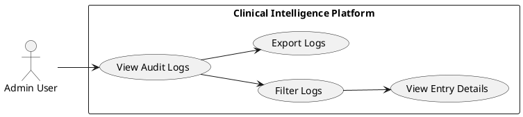

---

## UX Requirements

### Authentication Interface
- **UXR-001:** System MUST provide a clean, professional login page with healthcare-appropriate design and branding
- **UXR-002:** System MUST display clear, actionable validation errors for invalid login attempts with specific guidance
- **UXR-003:** System MUST provide "Forgot Password" link prominently displayed on login page
- **UXR-004:** System MUST show loading indicators during authentication process with progress feedback
- **UXR-005:** System MUST NOT provide public user registration form - only Admin can create users
- **UXR-006:** System MUST display password strength indicators during registration and password reset
- **UXR-007:** System MUST provide password reset form accessible via email token with clear instructions
- **UXR-008:** System MUST show logout confirmation and redirect to login page with success message
- **UXR-009:** System MUST display account lockout messages with clear unlock timeframes
- **UXR-010:** System MUST provide rate limiting messages with retry timeframes when HTTP 429 is returned
- **UXR-011:** System MUST display user creation confirmation after Admin creates new user
- **UXR-012:** System MUST show password complexity requirements prominently during input

### General UI/UX
- **UXR-013:** System MUST provide intuitive navigation with maximum 3 clicks to any feature
- **UXR-014:** System MUST comply with WCAG 2.1 AA accessibility standards
- **UXR-015:** System MUST adapt seamlessly to desktop viewports (1280px+)
- **UXR-016:** System MUST follow consistent design system with defined color palette
- **UXR-017:** System MUST provide real-time feedback for all user actions within 200ms
- **UXR-018:** System MUST display clear, actionable error messages with recovery options

### Document Upload Interface
- **UXR-019:** System MUST provide drag-and-drop file upload functionality
- **UXR-020:** System MUST display upload progress with percentage indicator
- **UXR-021:** System MUST show clear file validation errors (size, type)
- **UXR-022:** System MUST allow batch selection of multiple files

### Verification Screen
- **UXR-023:** System MUST display side-by-side view: original PDF and extracted data
- **UXR-024:** System MUST highlight source text when user clicks extracted data (XAI)
- **UXR-025:** System MUST visually distinguish verified, unverified, and modified data
- **UXR-026:** System MUST provide inline editing for all extracted fields
- **UXR-027:** System MUST provide clear visual hierarchy for data categories

### Conflict Resolution UI
- **UXR-028:** System MUST prominently display conflicts requiring resolution
- **UXR-029:** System MUST show conflicting values side-by-side with source documents
- **UXR-030:** System MUST require explicit user selection to resolve conflicts
- **UXR-031:** System MUST prevent finalization until all conflicts are resolved

### Billing Codes Interface
- **UXR-032:** System MUST display suggested codes with descriptions and source references
- **UXR-033:** System MUST provide search/filter for adding new codes
- **UXR-034:** System MUST allow one-click removal of suggested codes
- **UXR-035:** System MUST show code validation status (valid/invalid/deprecated)

### AI Clinical Assistant
- **UXR-036:** System MUST provide chat-style interface for natural language queries
- **UXR-037:** System MUST display typing indicator during AI response generation
- **UXR-038:** System MUST show source citations as clickable links
- **UXR-039:** System MUST provide suggested queries for common use cases

### Dashboard Interfaces
- **UXR-040:** System MUST provide visual charts and graphs for metrics
- **UXR-041:** System MUST support date range filtering for all metrics
- **UXR-042:** System MUST provide drill-down capabilities from summary to detail views
- **UXR-043:** System MUST display real-time updates for active processing

### Admin Interface
- **UXR-044:** System MUST provide searchable, sortable user management table
- **UXR-045:** System MUST provide filterable audit log viewer
- **UXR-046:** System MUST provide export functionality for reports and logs

---

## Risks & Mitigations

| # | Risk | Impact | Probability | Mitigation |
|---|------|--------|-------------|------------|
| 1 | **AI Hallucination in Entity Extraction** - LLM generates entities not present in source documents | High - Patient safety, trust loss | Medium | FR-051/FR-056 enforce 100% grounding with source citation validation; reject entities without valid citations |
| 2 | **Conflict Detection Accuracy** - System fails to identify critical data conflicts across documents | High - Clinical/financial risk | Medium | FR-057-FR-059 use LLM-based conflict identification with structured output; comprehensive conflict categories in system prompt |
| 3 | **HIPAA Compliance Breach** - Unauthorized access to PHI or audit trail gaps | Critical - Regulatory penalties | Low | FR-097-FR-103 immutable audit trail; FR-109-FR-113 vector data security; FR-010-FR-013 strict RBAC |
| 4 | **Performance Degradation Under Load** - Processing time exceeds targets with increased documents | Medium - User productivity impact | Medium | NFR 7.2 defines clear performance targets; asynchronous processing (FR-023-FR-029); horizontal scaling via message queue |
| 5 | **ICD-10/CPT Code Mapping Accuracy** - Fuzzy matching produces incorrect code suggestions | Medium - Billing errors | Medium | FR-067-FR-070 human-in-the-loop Accept/Reject workflow; source reference links for verification; manual entry fallback |

---

## Constraints & Assumptions

| # | Type | Description | Rationale |
|---|------|-------------|-----------|
| 1 | **Constraint** | Phase 1 is standalone - no direct EHR integration | Reduces adoption friction; enables faster time-to-market; integration-ready via FHIR-compatible models |
| 2 | **Constraint** | Human-in-the-loop required for all AI outputs | Core "Trust-First" principle; user always final verifier; builds confidence for eventual autonomous features |
| 3 | **Assumption** | Users have access to Chrome or Edge (last 2 major versions) | FR-122/NFR 7.4 - Enterprise workstations typically run these browsers; covers >90% of healthcare IT environments |
| 4 | **Assumption** | Google Gemini API remains available with current pricing/performance | Technology stack dependency; contingency: architecture supports LLM abstraction for provider switch |
| 5 | **Constraint** | PDF/DOCX only for Phase 1 document formats | Covers majority of clinical documents; image/fax OCR deferred to Phase 2 to reduce scope risk |
| 6 | **Constraint** | Single static admin account for Phase 1 | Simplifies initial deployment and user management; static admin creates all Standard User accounts; eliminates need for admin provisioning workflow |
