# UML Text-Based Code Standards

PlantUML and Mermaid diagram standards: clarity, consistency, single-page focus.

## Core Principles

- One diagram = one story; max 6-8 containers/components and 6-8 externals/actors
- Reuse same visual elements for same roles across diagrams
- Move complex internals to separate lower-level diagrams

## 1. Boundary Scopes

- Nest: Context → System → Container/Component (max 3 levels)
- Group only related elements; label with purpose

**PlantUML:**
```plantuml
package "System Boundary" {
  component "Component A"
  component "Component B"
}
```

**Mermaid:**
```mermaid
subgraph "System Boundary"
  ComponentA[Component A]
  ComponentB[Component B]
end
```

## 2. Containers / Components

- One container = one deployable unit with single responsibility
- Label: `Name (Technology) - Responsibility` (max 1 line)
- Reuse same symbol for same role

**Examples:**
- ✓ `API Gateway (Kong) - Routes & authenticates requests`
- ✓ `User Service - Manages user profiles`
- ✗ `API Gateway (Kong) - Routes requests, authenticates users, handles rate limiting, logs traffic`

## 3. Colors & Styles

Use color to encode type (max 4-5 colors):
| Type | Color/Style | Usage |
|------|-------------|-------|
| Actor | Blue | Human users, external systems |
| Core System | Green | Primary application components |
| External System | Gray | Third-party services, legacy systems |
| Data Store | Yellow | Databases, caches, message queues |
| Tooling/DevOps | Orange | CI/CD, monitoring, infrastructure |

**Line Styles:** Solid = internal/sync; Dashed = external/async

**PlantUML:**
```plantuml
actor User #LightBlue
component "Core API" #LightGreen
database "PostgreSQL" #Yellow
component "External Service" #LightGray

User --> "Core API" : HTTPS
"Core API" ..> "External Service" : Async
```

**Mermaid:**
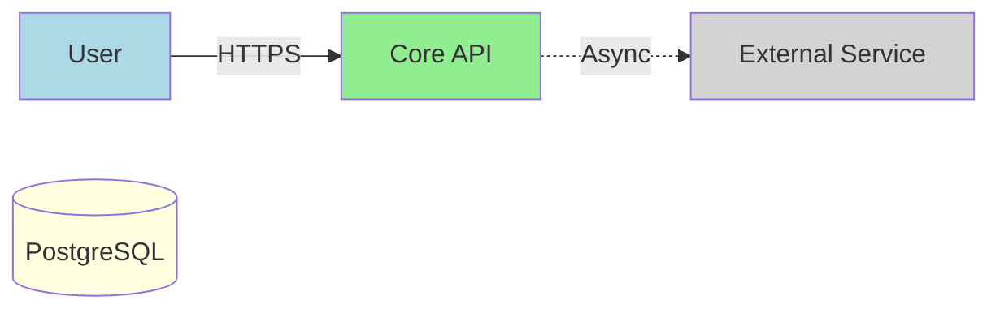

## 4. Layout & Format

- Flow: Left → Right or Top → Bottom (consistent)
- Align tiers horizontally (UI, API, Data, Integration)
- Labels: max 50 chars

**PlantUML:**
```plantuml
left to right direction
' or
top to bottom direction

skinparam linetype ortho
```

**Mermaid:**
```mermaid
graph LR  %% Left to Right
' or
graph TB  %% Top to Bottom
```

## 5. Connectors

- Straight, shortest-path arrows; avoid crossing
- Use hub node for fan-out scenarios
- Label: `Protocol / Type - Purpose` (max 1 line)

**Examples:**
- ✓ `HTTPS / REST - Get profile`
- ✓ `Message Queue - Order created event`
- ✗ `HTTPS REST API call to retrieve user profile data and related metadata`

**PlantUML:**
```plantuml
A --> B : HTTPS / REST\nGet profile
C ..> D : Message Queue\nOrder created
```

**Mermaid:**
```mermaid
A -->|HTTPS / REST - Get profile| B
C -.->|Message Queue - Order created| D
```

## 6. Diagram Types

### PlantUML

**Use Case Diagram** - Functional requirements, user goals

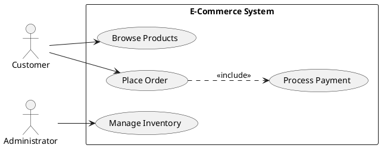

**Use Case Diagram Best Practices: One Diagram Per Use Case**

When creating use case diagrams for requirements specifications, follow this approach:

- **One Diagram**: Each use case specification should have its own focused diagram
- **Include Only Relevant Actors**: Show only actors directly involved in that specific use case
- **System Boundary**: Use rectangle to define system boundary
- **Limit Scope**: Keep to 3-5 actors per diagram for clarity
- **Individual Focus**: Each diagram represents a single goal/scenario

**Example: Individual Use Case Diagram (UC-002)**
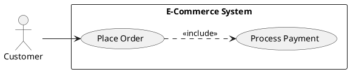

**Data Flow Diagram** - Data movement through processes

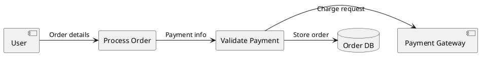

**Component Diagram** - Internal structure and dependencies

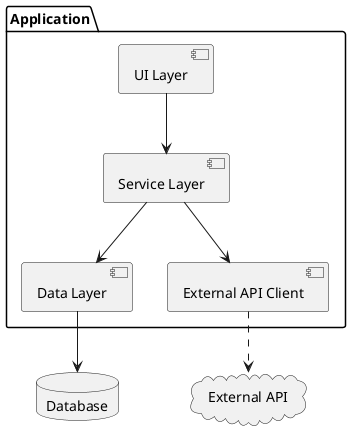

**Sequence Diagram** - Time-ordered interactions

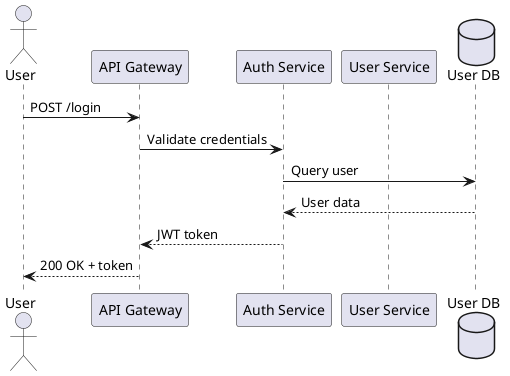

### Mermaid

**Graph** - System context, component relationships

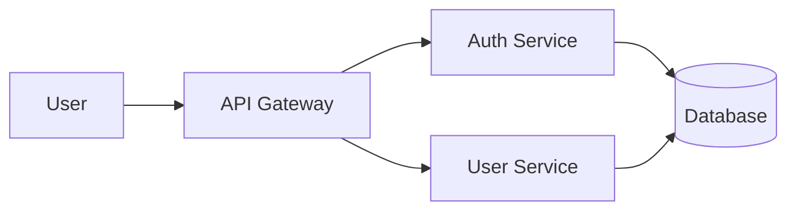

**Sequence Diagram** - Interaction flows, API sequences

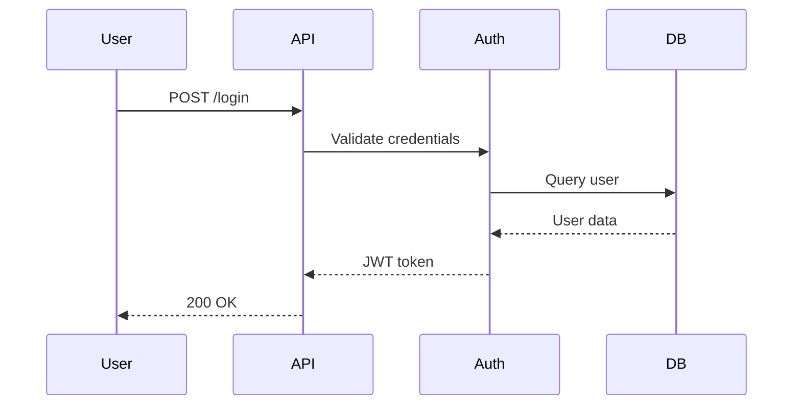

**C4 Context** - System boundaries, external dependencies

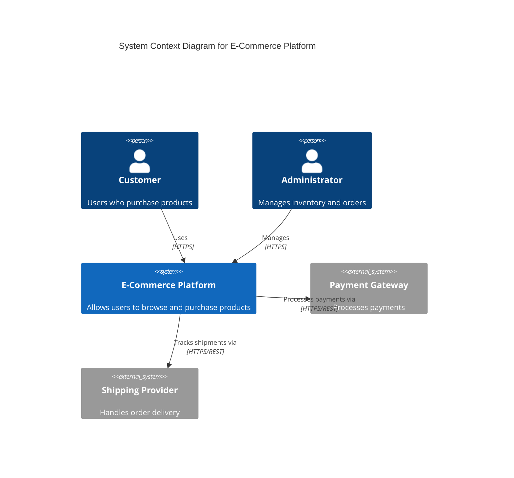

**C4 Component** - Internal structure, technology stack

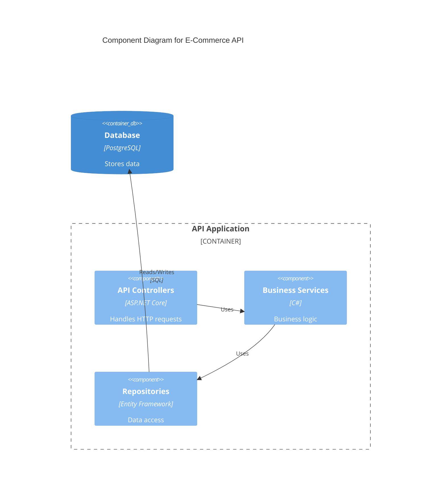

**Architecture (Beta)** - Deployment, infrastructure

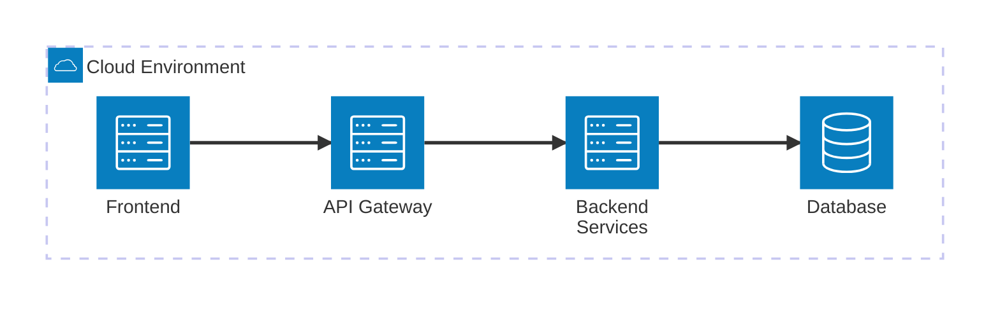

## 7. Anti-Patterns

- **Spaghetti**: Too many crossing connectors; use hub nodes or split
- **God Component**: One element connected to all; decompose
- **Inconsistent Symbols**: Same role, different representations
- **Color Chaos**: >5 colors or no semantic meaning
- **Over-nesting**: >3 boundary levels
- **Kitchen Sink**: >10 elements; extract subviews

## 8. Usage Guide

| Scenario | Diagram | Tool |
|----------|---------|------|
| User interactions | Use Case | PlantUML |
| System boundaries | C4 Context | Mermaid |
| Internal components | Component | PlantUML/Mermaid |
| API flow | Sequence | PlantUML/Mermaid |
| Data movement | Data Flow | PlantUML |
| Infrastructure | Architecture | Mermaid |

## 9. References
- Refer `https://www.geeksforgeeks.org/system-design/use-case-diagram/`using websearch to understand the use case diagram and visual representations.
- Refer to `https://www.uml-diagrams.org/uml-25-diagrams.html` for detailed understanding of the various diagrams and visual representation. 
- Refer `https://docs.mermaidchart.com/icons/intro` on the usage of the icons.