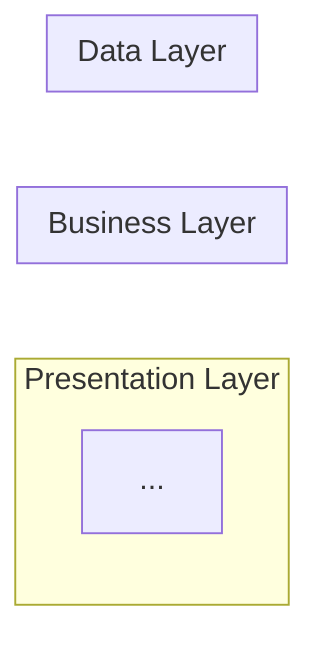

# Design Model Generator

As an expert Software Architect and UML specialist, generate comprehensive visual models and diagrams that represent the system architecture and behavior. This workflow creates all UML artifacts based on requirements from spec.md/codeanalysis.md and architectural decisions from design.md.

## Input Parameter (Requirements File): $ARGUMENTS (Optional)
**Accepts:** File path to spec.md, codeanalysis.md, or requirements document
**Supported File Types:** .md | .txt

### Input Processing Instructions
**CRITICAL**: Before proceeding with model generation, you MUST determine input type and process accordingly:

#### Input Type Detection
1. **File Path Detection**: Check if `$ARGUMENTS` contains a file path (contains file extensions .md, .txt)
2. **Default Fallback**: If `$ARGUMENTS` is empty, refer to `.propel/context/docs/spec.md` or `.propel/context/docs/codeanalysis.md`

#### File Input Processing
If `$ARGUMENTS` is a file path:
1. **File Existence Check**: Verify the file exists using appropriate tools
2. **Read File Contents**: Extract content from the provided file
3. **Content Validation**: Ensure file contents contain use case specifications (UC-XXX)

#### Default Input Processing
If `$ARGUMENTS` is not provided:
1. **Spec File Check**: Look for `.propel/context/docs/spec.md` first
2. **Codebase Analysis Fallback**: If spec.md doesn't exist, use `.propel/context/docs/codeanalysis.md`
3. **Design File Required**: Also read `.propel/context/docs/design.md` for architectural context
4. **Content Validation**: Ensure source files contain sufficient use case and architecture information

#### Fallback Handling
- If spec/codeanalysis file cannot be read: Request user to provide alternative file path
- If design.md doesn't exist: Request user to run design-architecture workflow first
- If no use cases found: Request user to ensure spec.md contains UC-XXX specifications

## Output
- Artifact generation: `.propel/context/docs/models.md`
- Print the following:
  - List of rules used by the workflow in bulleted format
  - List of use cases processed (UC-XXX)
  - Evaluation Scores in tabular format with average score.
  - Evaluation summary (less than 100 words).
  **Do not save as file.** (console output only)

**Note:**
- If the output file is already available make the necessary changes to applicable sections. Do not overwrite the whole file.
- Always create the output file in manageable smaller chunks to manage memory and processing constraints.
- Always generate a single unified document.
- Generate the output using the `.propel/templates/design-model-templates.md` template.

## Essential Project Intelligence

### Reference Materials Integration
- **spec.md/codeanalysis.md**: Source of truth for use cases and requirements
- **design.md**: Source of truth for architecture and entities
- **Existing Codebase**: Analyze for actual component names and interactions

*** Comprehensive understanding of both requirements and design is non-negotiable ***

### References Package
```yaml
- file: .propel/context/docs/spec.md
  why: Use case specifications for sequence diagrams

- file: .propel/context/docs/codeanalysis.md
  why: Alternative source for use cases in brown-field projects

- file: .propel/context/docs/design.md
  why: Architecture decisions and entity definitions

- url: [Mermaid documentation]
  why: Syntax reference for diagram generation
```

## Core Principles
- **UC-XXX to Sequence Mapping**: Every use case gets exactly one sequence diagram
- **Design Consistency**: All diagrams align with design.md architectural decisions
- **Standard Notation**: Use Mermaid for most diagrams, PlantUML for Data Flow

## Execution Flow

### 1. Source Analysis
- Read spec.md or codeanalysis.md to extract all use cases (UC-XXX)
- Read design.md to understand architectural decisions and entities
- Generate architectural diagrams based on design.md content
- Generate one sequence diagram for each UC-XXX

### 2. Research Process

#### Requirements Analysis (use Sequential-Thinking MCP)

**Fallback Mechanism:** If the sequential-thinking MCP tool fails or is unavailable, automatically fall back to standard iterative analysis approach using Web fetch:
- Perform systematic step-by-step analysis
- Use structured thinking with explicit validation checkpoints
- Ensure no degradation in analysis quality or completeness

**Requirements Extraction:**
- Parse all use cases (UC-XXX) from spec.md or codeanalysis.md
- Extract actors, goals, preconditions, success scenarios, extensions
- Identify system boundaries and external actors
- Document data flows and process steps

#### Design Context Integration
- Read design.md for architecture goals and patterns
- Extract core entities and their relationships
- Understand technology stack choices
- Map NFR, TR, DR requirements to architectural views

#### External Research
- **Mermaid Documentation**: Use Context7 MCP for Mermaid syntax and best practices
- **PlantUML Documentation**: Reference PlantUML syntax for data flow diagrams
- **UML Standards**: Ensure compliance with UML 2.0 notation standards

### 3. Model Generation Framework

**Before writing diagrams, list all diagrams to generate:**
| Diagram Type | Source | Purpose |
|--------------|--------|---------|
| Conceptual | design.md | High-level architecture |
| Component | design.md | Module breakdown |
| Sequence (per UC-XXX) | spec.md | UC-001, UC-002... |
| ERD | design.md | Data model |
**Now expand each diagram listed above.**

#### UML Models Overview Section
Generate short description explaining:
- Purpose of the UML diagrams
- How diagrams relate to spec.md/codeanalysis.md and design.md
- Navigation guide for the document

#### Architectural Views Generation

**3.1 System Context Diagram (Plantuml)**

- Show system's boundary and its main function
- Interactions with the external entities (users, other systems) via data flows
- Represent high-level system structure

**3.2 Component Architecture Diagram (Mermaid)**

- Break down into individual modules/components
- Show responsibilities and interfaces
- Document component communication paths

**3.3 Deployment Architecture Diagram (plantuml)**

```plantuml
@startuml
...
@enduml
```

- Cloud landing zone deployment view with hub-and-spoke networking: Shared Services (Hub), Workloads (Dev/Test/Prod), Security, and Management.
- Render flow left-to-right with concise labels.
- Use provider-specific sprites/icons when available; otherwise use built-in cloud/node/database shapes.

**3.4 Data Flow Diagram (PlantUML)**

- Show data sources and transformations
- Document data stores and their connections
- Visualize data processing pipeline

**3.5 Logical Data Model / ERD (Mermaid)**
```mermaid
erDiagram
    ENTITY1 ||--o{ ENTITY2 : relationship
    ...
```
- Represent entities from design.md Core Entities
- Show attributes and relationships
- Document cardinality and constraints

#### Sequence Diagrams Generation

**CRITICAL**: Generate ONE sequence diagram for EACH use case (UC-XXX) from spec.md/codeanalysis.md

**For each UC-XXX:**
1. Read use case specification from source document
2. Extract actors, system components (high-level), and data stores
3. Map success scenario steps to message flows
4. Include alternative flows and error handling
5. Generate Mermaid sequence diagram

**Template per UC-XXX:**
```markdown
#### UC-XXX: [Use Case Name]
**Source**: [spec.md#UC-XXX](.propel/context/docs/spec.md#UC-XXX) or [codeanalysis.md#UC-XXX](.propel/context/docs/codeanalysis.md#UC-XXX)

```mermaid
sequenceDiagram
    participant Actor as [Actor Name]
    participant System as [System Component]
    participant Backend as [Backend Service]
    participant Database as [Data Store]

    Note over Actor,Database: UC-XXX - [Use Case Name]

    Actor->>System: [Step 1 from use case]
    System->>Backend: [Internal processing]
    Backend->>Database: [Data operation]
    Database-->>Backend: [Data response]
    Backend-->>System: [Processing result]
    System-->>Actor: [Final outcome]
```
```

### 4. Design Generation
- Read template from `.propel/templates/design-model-templates.md`
- Populate template with all architectural views
- Generate sequence diagrams for each UC-XXX
- Use Write tool to create artifact `.propel/context/docs/models.md`
- Ensure all template sections are populated with real data

### 5. Summary Presentation
- Present executive summary to user
- List all UC-XXX processed with sequence diagrams
- Highlight critical architectural views
- Provide link to detailed models in `.propel/context/docs/models.md`
- Present the Quality Assessment metrics

**Model Validation (use sequential thinking MCP if available):**
- Validate all UC-XXX have sequence diagrams
- Ensure diagrams align with design.md architecture
- Verify ERD matches Core Entities from design.md
- **Fallback**: Create explicit validation checklist and document decision rationale

### Quality Assurance Framework

#### Pre-Delivery Checklist
- [ ] **Use Case Coverage**: All UC-XXX from spec.md/codeanalysis.md have sequence diagrams
- [ ] **Diagram Consistency**: All diagrams align with design.md architecture
- [ ] **Entity Alignment**: ERD entities match design.md Core Entities
- [ ] **Syntax Validation**: All Mermaid/PlantUML code is syntactically correct
- [ ] **Source References**: Each sequence diagram links to source UC-XXX
- [ ] **No Duplicate Use Case Diagrams**: Use case diagrams remain in spec.md only
- [ ] **Template Adherence**: Output follows design-model-templates.md structure

## Guardrails
- `rules/ai-assistant-usage-policy.md`: Explicit commands; minimal output
- `rules/dry-principle-guidelines.md`: Single source of truth; delta updates
- `rules/iterative-development-guide.md`: Strict phased workflow
- `rules/markdown-styleguide.md`: Front matter, heading hierarchy, code fences
- `rules/software-architecture-patterns.md`: Pattern selection, boundaries
- `rules/uml-text-code-standards.md`: PlantUML/Mermaid notation standards

**>>> MANDATORY: Execute Quality Evaluation and Detection Rules. IF any gate fails, execute Self-Healing. <<<**

**Execution Steps:**
1. Score each dimension in the Quality Assessment table below
2. Apply Detection Rules to validate scores and calculate penalties
3. IF any MUST gate failed OR any score is below its threshold: Execute Self-Healing Protocol (Retry Flow)
4. Print the completed evaluation table with final scores
5. Print the Overall Score and Evaluation Summary

## Quality Evaluation

Once the output is generated, Score the models generated to evaluate their quality against the following metrics, providing a percentage score (1-100%) for each.

### Model Quality Assessment

| # | Evaluation Dimension | Score | Gate | Assessment Criteria |
|---|---------------------|-------|------|---------------------|
| 1 | Template Adherence | [0-100%] | MUST=100% | Output conforms to design-model-templates.md structure; no extra sections |
| 2 | Diagram Syntax | [PASS/FAIL] | MUST PASS | All Mermaid/PlantUML code renders without errors |
| 3 | Use Case Coverage | [0-100%] | >=80% | All UC-XXX have corresponding sequence diagrams |
| 4 | Architecture Alignment | [0-100%] | >=80% | Diagrams reflect design.md architectural decisions |
| 5 | Entity Consistency | [0-100%] | >=80% | ERD entities match Core Entities from design.md |
| 6 | Traceability | [0-100%] | >=80% | Each diagram links to source requirements |

### Detection Rules

| # | Detection Logic | Penalty |
|---|-----------------|---------|
| 1 | Compare sections vs design-model-templates.md | Missing: -20%; Extra: -15% |
| 2 | Parse Mermaid/PlantUML blocks; validate syntax | Render error: BLOCKED |
| 3 | Count UC-XXX in spec.md; verify sequence diagram exists | Missing diagram: -15%/UC |
| 4 | Cross-reference diagram entities vs design.md decisions | Mismatch: -10%/instance |
| 5 | Compare ERD entities vs Core Entities in design.md | Missing entity: -10%; Extra: -5% |
| 6 | Each diagram has requirement ID reference | No reference: -10%/diagram |

**Overall Score**: [Weighted Average]%

**Evaluation Summary** (Top 3 Weaknesses):
1. **[Lowest Dimension]** ([X]%): [Specific reason]
2. **[2nd Lowest]** ([X]%): [Specific reason]
3. **[3rd Lowest]** ([X]%): [Specific reason]

**Critical Failures**: [List any MUST gates that failed, or "None"]

### Self-Healing Protocol

**Retry Limits:** 1 patch attempt per failing dimension | Mode: Edit-in-place only

**Patchable:**
| Dimension | Patch Action |
|-----------|--------------|
| Template Adherence | Append missing section to file |
| Use Case Coverage | Add missing sequence diagram |
| Design Alignment | Fix entity mismatches |
| ERD Completeness | Add missing entities |
| Traceability | Add requirement references |

**Non-Patchable (Skip):** Syntax Validation (diagram render errors), source missing, hallucinated content, patch >30% of section, >=3 failing dimensions

**Retry Flow:**
```
IF output file missing: ABORT (no retry)
READ existing output
FOR each failing dimension:
  IF patchable AND patch < 30%: EDIT in-place; RE-EVALUATE once
  ELSE: REPORT "[MANUAL FIX] {dimension}"
IF >=3 manual fixes needed: ABORT all retries
```

---

*This design model generator ensures comprehensive visual documentation with accurate UML diagrams, use case traceability, and architectural consistency.*
